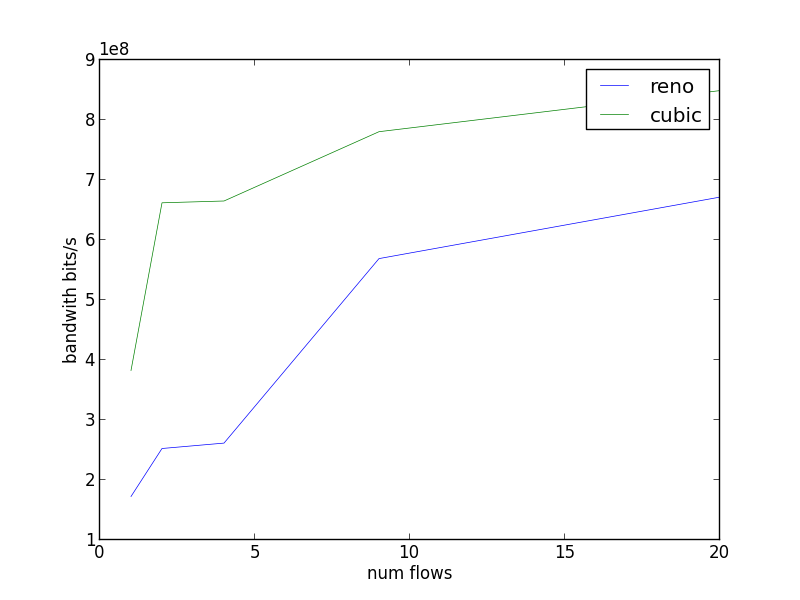

****************
execo user guide
****************

In this user guide, the code can be executed from python source files,
but it can also be run interactively in a python shell, such as
``ipython``, which is very convenient to inspect the execo objects.

Installation
============

Prerequisites: see corresponding section in :doc:`readme`.

In this tutorial it is shown how to install execo in subdirectory
``.local/`` of your home, allowing installation on computers where you
are not root or when you don't want to mix manually installed packages
with packages managed by your distribution package manager.

- Install from a release tar.gz package::

   $ wget http://execo.gforge.inria.fr/downloads/execo-2.6.1.tar.gz
   $ tar xzf execo-2.6.1.tar.gz
   $ cd execo-2.6.1/
   $ python setup.py install --user

- Or install from source repository if you want the very latest
  version::

   $ git clone git://scm.gforge.inria.fr/execo/execo.git
   $ cd execo
   $ python setup.py install --user

- Or install with ``pip`` or ``easy_install``::

   $ pip install --user execo

  or::

   $ easy_install --user execo

  If running pip or easy_install from inside grid5000, don't forget to::

   $ export http_proxy="http://proxy:3128"
   $ export https_proxy="https://proxy:3128"

- Or install from debian package::

   $ dpkg -i python-execo_2.6.1_all.deb

Configuration
=============

Execo reads configuration file ``~/.execo.conf.py``. A sample
configuration file ``execo.conf.py.sample`` is created in execo source
package directory when execo is built. This file can be used as a
canvas to overide some particular configuration variables. See
detailed documentation in :ref:`execo-configuration`, :ref:`Grid5000
Configuration <execo_g5k-configuration>` and
:ref:`execo_g5k-perfect_configuration`.

execo generalities
==================

One of the execo paradigms is that concurrent remote operations will
necessarily fail (especially when their number increases). Such
conditions in execo are handled as metadata associated with the
process or actions objects, so the programming flow does not need to
continuously check for return codes or catch exceptions.

Thus, when, for example, several remote processes are run and some of
them fail, there is no error nor interruption of the program. The
failed processes record the error (there are actually two kinds of
errors: the process returning a value != 0, or an operating system
error, for situations where the process executable was not
found). When a program tries to write to the stdin of several
processes, if some writes fail (because of an invalid stdin file
descriptor, for example), same thing: this is recorded and the program
keeps executing.

The default behavior on every kind of error, is to log the error, but
some process flags can instruct execo to not log such errors (in cases
where we, programmer, do "know" that the error is "normal").

Process and Action instances have an ``ok`` meta-flag which summarizes
their various state flags. There are also some process flags which can
instruct particular processes or actions to ignore some flags when
computing if the process is ``ok``. For example, we can run a
particular executable whose return value is always different from 0,
though this is not an error condition. We can instruct the process to
ignore this when computing its ``ok`` meta-flag.

As many process and action methods do not need to return a status,
instead *method chaining* is widely used in execo: most process or
actions methods return the object itself (*self*). For example,
``process.run()`` is the equivalent of (and can be written as)
``process.start().wait()``. Method chaining can provide a more fluent
syntax in some situations.

execo
=====

Core module. Handles launching of several operating system level
processes in parallel and controlling them *asynchronously*.  Handles
remote executions and file copies with ssh/scp and taktuk.

- Standalone processes: `execo.process.Process`, `execo.process.SshProcess`

- Parallel processes: `execo.action.Action`

Processes
---------

- `execo.process.Process`: abstraction of an operating system
  process. Fine grain asynchronous lifecycle handling:

  - start, wait, kill

  - stdout, stderr, error, pid, exit code

  - start date, end date

  - timeout handling

  - callbacks

  - shell; pty

- `execo.process.SshProcess`: Same thing but through ssh. Additional
  parameter: Host, ConnectionParams

  - Host: abstraction of a remote host: address, user, keyfile, port

  - ConnectionParams: connection parameters, ssh options, ssh path,
    keyfile, port, user, etc.

- `execo.process.Serial` and `execo.process.SerialSsh`: local or
  remote (over ssh) connection to a serial port.

- `execo.process.PortForwarder`: port forwarder process

Process examples
................

Local process
'''''''''''''

List all files in the root directory::

 from execo import *
 process = Process("ls /")
 process.run()
 print "process:\n%s" + str(process)
 print "process stdout:\n" + process.stdout
 print "process stderr:\n" + process.stderr

The ``ls`` process was directly spawned, not using a subshell. Set
process property ``shell`` to True if a full shell environment
is needed (e.g. to expand environment variables or to use pipes). To
find all files in /tmp belonging to me::

 process = Process("find /tmp -user $USERNAME", shell = True)
 process.run()

Here a warning log was probably displayed, because if you are not
root, there are probably some directories in ``/tmp`` that ``find``
could not visit (lack of permissions), ``find`` does not return 0 in
this case. The default behavior of execo is to issue warning logs when
processes are in error, do not return 0, or timeout. If needed we can
instruct execo to stop logging the exit code by setting process property
``nolog_exit_code`` to True. In this case, no log will be issued
but the process will still be considered in error from execo's point
of view. You can also instruct execo to ignore the exit code by
setting process property ``ignore_exit_code`` to True.

Remote process over ssh
'''''''''''''''''''''''

On one host *host1* Start an `execo.process.SshProcess` *process_A*
running a listening netcat, then on another host
*host2* start an `execo.process.SshProcess` *process_B* running netcat
sender, then wait for *process_B* termination, then kill
*process_A*::

 from execo import *
 with SshProcess("nc -lvp 6543", "<host1>").start() as receiver:
   sleep(1)
   sender = SshProcess("echo 'hi there!' | nc -q 0 <host1> 6543", "<host2>").run()
   receiver.wait()
 print receiver.stdout

This example shows the asynchronous control of processes: while a
process is running (the netcat receiver), the code can do something
else (run the netcat sender), and later get back control of the first
process, waiting for it (it could also kill it).

The process class hierarchy provides python context managers, so at
the end of a block of code starting with ``with <process> as ...``,
the process will automatically be killed. Note that as with many
things in execo, this kill is asynchronous, so when the program gets
out the with block, the kill signal is issued, but the process may not
be properly killed yet when executing the next instruction. So if you
need to be sure that the process has finished, you need to wait for
it, hence the line ``receiver.wait()``, to make sure that every output
of the receiver process has been caught before printing its stdout.

This example also illustrates *method chaining*:

- the ``start()`` method can be immediately called on the instanciated
  sender process within the ``with`` statment, because
  ``process.start()`` return the process itself.

- the sender process is instanciated, ``run()`` is called on it, and
  the result can be affected to the sender variable because run()
  returns the object itself.

In this example, We sleep for 1 second after starting the server to
make sure that it is ready to receive incoming connections (without
this sleep, it may work, perhaps most of the time, because netcat is
fast, but we can't be sure). A better way to make sure the server is
ready is to scan its verbose output (we add option ``-v`` to netcat
receiver)::

 from execo import *
 with SshProcess("nc -vlp 6543", "<host1>").start() as receiver:
   receiver.expect("^[Ll]istening on")
   sender = SshProcess("echo 'hi there!' | nc -q 0 <host1> 6543", "<host2>").run()
   receiver.wait()
 print receiver.stdout

Of course, this kind of code only works if you are sure that the
version of netcat which is installed on ``<host1>`` is the one you
expect, which outputs the string ``listening on ...`` on its standard
output when in verbose mode and when its socket is listening (on
debian, you need nc.traditional)

Interaction with processes: writing to a process stdin, expecting from a process stdout, on a remote serial port over ssh
'''''''''''''''''''''''''''''''''''''''''''''''''''''''''''''''''''''''''''''''''''''''''''''''''''''''''''''''''''''''''

This example shows automation of an interactive login on a serial
console connected via an usb serial adapter to a remote host. It makes
use of the ``write`` method of processes, which allows printing to
processes, and of the ``expect`` method of processes, which scans and
waits process output for regular expressions::

 from execo import *
 prompt = '^~ #\s*$'
 with SerialSsh("<host>", "/dev/ttyUSB1", 115200).start() as serial:
   print >> serial
   serial.expect('^\w login:\s*$')
   print >> serial, "<login>"
   serial.expect('^Password:\s*$')
   print >> serial, "<password>"
   serial.expect(prompt)
   print >> serial, "<command>"

Actions
-------

- `execo.action.Action`: abstraction of a set of parallel
  Process. Asynchronous lifecycle handling:

  - start, kill, wait

  - access to individual Process

  - callbacks

  - timeout

  - errors

- `execo.action.Local`: A set of parallel local Process

- `execo.action.Remote`: A set of parallel remote SshProcess

- `execo.action.TaktukRemote`: Same as Remote but using taktuk instead
  of plain ssh

- `execo.action.Put`, `execo.action.Get`: send files or get files in
  parallel to/from remote hosts

- `execo.action.TaktukPut`, `execo.action.TaktukGet`: same using
  taktuk

- `execo.report.Report`: aggregates the results of several Action and
  pretty-prints summary reports

- `execo.action.ChainPut`: efficient broadcast (copy) of big files to
  high number of hosts

- `execo.action.RemoteSerial`: A set of parallel connections to remote
  serial ports over ssh.

Remote example
..............

Run a netcat client and server simultaneously on two hosts, to
generate traffic in both directions::

 from execo import *
 hosts = [ "<host1>", "<host2>" ]
 targets = list(reversed(hosts))
 servers = Remote("nc -l -p 6543 > /dev/null", hosts)
 clients = Remote("dd if=/dev/zero bs=50000 count=125 | nc -q 0 {{targets}} 6543", hosts)
 with servers.start():
   sleep(1)
   clients.run()
   servers.wait()
 print Report([ servers, clients ]).to_string()
 for s in servers.processes + clients.processes:
   print "%s\nstdout:\n%s\nstderr:\n%s" % (s, s.stdout, s.stderr)

The netcat command line on clients shows the usage of *substitutions*:
In the command line given for Remote and in pathes given to Get, Put,
patterns are automatically substituted:

- all occurences of the literal string ``{{{host}}}`` are substituted by
  the address of the Host to which execo connects to.

- all occurences of ```` are substituted in the
  following way: ``<expression>`` must be a python expression, which
  will be evaluated in the context (globals and locals) where the
  expression is declared, and which must return a
  sequence. ```` will be replaced by
  ``<expression>[index % len(<expression>)]``. In short, it is a
  mapping between the sequence of command lines run on the hosts and
  the sequence ``<expression>``. See :ref:`execo-substitutions`.

Interaction with remotes: writing processes stdin, expecting from stdout, on several remote serial port over ssh
''''''''''''''''''''''''''''''''''''''''''''''''''''''''''''''''''''''''''''''''''''''''''''''''''''''''''''''''

This example shows the automation of an
interactive login on several serial consoles connected to usb serial
adapters on a set of remote host. It makes use of the ``write`` method of
actions, which allows printing to actions, and of the ``expect``
method of actions, which scans and waits process output for regular
expressions::

 from execo import *
 prompt = '^~ #\s*$'
 with RemoteSerial(<list_of_hosts>, "/dev/ttyUSB1", 115200).start() as serial_ports:
   print >> serial_ports
   serial_ports.expect('^\w login:\s*$')
   print >> serial_ports, "<login>"
   serial_ports.expect('^Password:\s*$')
   print >> serial_ports, "<password>"
   serial_ports.expect(prompt)
   print >> serial_ports, "<command>"

It is almost identical to the remote serial process example, except
that it handles several remote serial ports in parallel.

execo_g5k
=========

A layer built on top of execo. It's purpose is to provide a convenient
API to use Grid5000 services:

- oar

  - oarsub, oardel

  - get current oar jobs

  - wait oar job start, get oar job nodes

- oargrid

  - oargridsub, oargriddel

  - get current oargrid jobs

  - wait oargrid job start, get oargrid job nodes

- kadeploy3

  - deploy: clever kadeploy: automatically avoids to deploy already
    deployed nodes, handles retries on top of kadeploy, callbacks to
    allow dynamically deciding when we have enough nodes (even for
    complex topologies)

- Grid5000 API:

  - list hosts, clusters, sites and network equipments

  - get the cluster of a host, the site of a cluster, the network equipments of a 
  	site, a cluster or a host 

  - get API attributes from hosts, clusters, sites, network equipments

  - all of this in a secure way: even when used from outside Grid5000,
    there is no need to put Grid5000 API password in clear in scripts,
    password can be stored in the desktop environment keyring if
    available.
    
  - a local disk is created in $HOME/.execo/g5k_api_cache

- planning: advanced interaction with oar scheduler: allows getting
  the full planning of resources on grid5000, as well as finding time
  slots where resources are available.
  
- topology: use grid5000 Network API to generate a networkx graph of the platform,
  with simple graphical export.

To use execo on grid5000, you need to install it inside grid5000, for
example on a frontend. execo dependencies are installed on grid5000
frontends. (Note: to use execo_g5k from outside Grid5000, see
:ref:`tutorial-configuration`)

oarsub example
--------------

Run iperf servers on a group of 4 hosts on one cluster, and iperf
clients on a group of 4 hosts on another cluster. Each client targets
a different server. We get nodes with an OAR submissions, and delete
the OAR job afterwards:

.. literalinclude:: code_samples/g5k_iperf.py
   :language: python

This example shows how python try / finally construct can be used to
make sure reserved resources are always released at the end of the
job. It also shows how we can use python tools (itertools.groupby) to
group hosts by cluster, to build an experiment topology, then use this
topology with execo substitutions. The exit code of the servers is
ignored (not counted as an error and not logged) because it is normal
that they are killed at the end (thus they always have a non-zero exit
code).

execo_g5k.api_utils
-------------------

This module provides various useful function which deal with the
Grid5000 API.

For example, to work interactively on all grid5000 frontends at the
same time: Here we create a directory, copy a file inside it, then
delete the directory, on all frontends simultaneously::

 from execo import *
 from execo_g5k import *
 sites = get_g5k_sites()
 Remote("mkdir -p execo_tutorial/",
        sites,
        connection_params = default_frontend_connection_params).run()
 Put(sites,
     ["~/.profile"],
     "execo_tutorial/",
     connection_params = default_frontend_connection_params).run()
 Remote("rm -r execo_tutorial/",
        sites,
        connection_params = default_frontend_connection_params).run()

If ssh proxycommand and execo configuration are configured as
described in :ref:`tutorial-configuration`, this example can be run
from outside grid5000.

Here is another example of a one-liner to list the measured flops of
each cluster::

 for cluster in get_g5k_clusters(): print cluster, ; print get_host_attributes(Host(cluster + "-1")).get("performance")

Other usage examples
====================

Check CPU performance settings of each Grid5000 clusters
--------------------------------------------------------

In this example, the planning module is used to automatically compute
how many resources we can get on Grid5000.

This code reserves one node on each grid5000 cluster immediately
available, for a 10 minutes job. Then it waits for the job start and
retrieves the list of nodes. Then, it remotely executes shell commands
to:

- get the current cpufreq governor for each core (p-states)

- detect if hyperthreading is on

- detect if c-states are on

- detect if turboboost is on

(see https://www.grid5000.fr/mediawiki/index.php/CPU_parameters_in_Grid5000)

To each remote process, a stdout_handler is added which directs its
stdout to a file called <nodename>.out on localhost:

.. literalinclude:: code_samples/g5k_check_cluster_cpu.py
   :language: python

This code shows:

- how some clusters / sites or nodes can be blacklisted if needed.

- how to use `execo_g5k.config.default_oarsh_oarcp_params` to connect
  to reserved nodes with ``oarsh``. Explicitely setting the job key is
  mandatory unless you set ``$OAR_JOB_KEY_FILE`` in your
  environnement, or set ``g5k_configuration['oar_job_key_file']``, as
  described in :ref:`execo_g5k-configuration` and
  :ref:`execo_g5k-perfect_configuration`.

- how to append a `execo.process.Process` ``stdout_handler`` which
  redirects output to a file.

- how to take care of releasing the oargridjob with a try/finally
  block.

After running this code, you get in the current directory on localhost
a file for each remote hosts containing the scaling governors,
hyperthreading state, c-states state, turboboost state (easy to check
if they are all the same with ``cat * | sort -u``)

Note that with this kind of code, there is still the possibility that
the oar or oargrid reservation fails, since oar is not transactional,
and someone can still reserve some resources between the moment we
inquire the available resources and the moment we perform the
reservation.

The planning module has several possibilities and modes, see its
documentation for further reference.

Using Taktuk to scale to many remote hosts
------------------------------------------

This example shows how `execo.action.Remote` can be (almost)
transparently changed to `execo.action.TaktukRemote` to scale to huge
number of remote hosts. It uses the planning module, to try to reserve
80% of as much nodes as possible, immediately available for a 15
minutes job. It then opens as many ssh connexions to each host as the
host's number or cpu cores, first using a `execo.action.TaktukRemote`,
then using `execo.action.Remote`, to compare performances. In each
remote connexion, it runs ``ping`` to send one ping packet to a
another random host of the reservation.

.. literalinclude:: code_samples/g5k_taktuk_perf.py
   :language: python

Using a job type ``allow_classic_ssh`` solves a lot of connection
issues, there is no need to deal with ``oarsh``.

Actually, what happens when running this code is that we can leverage
the huge scalabilty of `Taktuk <http://taktuk.gforge.inria.fr/>`_ (we
have tested with more than 5000 concurrent remote connections),
whereas parallel ``ssh`` will show various limitations, in particular
the number of open file descriptors. In our tests run on grid5000
frontends, we can not run more than around 500 parallel ssh (this
could probably be increased on a node where you have root
permissions).

This example also show using `execo_g5k.oar.oarsubgrid` instead of
`execo_g5k.oargrid.oargridsub`. They are similar but oarsubgrid
bypasses oargrid and directly performs parallel oar submissions.

Compare ChainPut and parallel scp performances on many hosts on Grid5000
------------------------------------------------------------------------

The following example shows how to use the `execo.action.ChainPut`
class (which also internally uses Taktuk) to perform optimized
transfers of big files to many hosts. It reserves 90% of the maximum
number of nodes immediately available on grid5000 for 15 minutes, and
broadcasts a generated random file of 50MB to all hosts both with
parallel ``scp`` and with ChainPut, to compare the performances. As
the parallel scp can be very resource hungry with a lot of remote
hosts, you should run this code from a compute node, not the frontend
(simply connect to a node with ``oarsub -I``):

.. literalinclude:: code_samples/g5k_chainput_perf.py
   :language: python

In this example, we use ``oarsh``. One of the constraints imposed by
``Taktuk`` is that any node of the connection tree must be able to
connect to any other. As the oargrid job key is only available on the
frontend on which the oargrid submission was done, we must propagate
this key to all nodes. This can be done with ``Taktuk`` option
``-S``. Alternatively, this is not needed if setting
``$OAR_JOB_KEY_FILE`` in your environnement, or setting
``g5k_configuration['oar_job_key_file']``, as described in
:ref:`execo_g5k-configuration` and
:ref:`execo_g5k-perfect_configuration`.

Analysis of TCP traffic Grid5000 hosts, using kadeploy
------------------------------------------------------

This example does not reserve the resources, instead it find all
currently running jobs, and tries to deploy to all nodes. It then
selects 2 nodes, connect to them as root, installs some packages, runs
tcp transfer between them, while, at the same time capturing the
network traffic, and finally it runs ``tcptrace`` on the captured
traffic:

.. literalinclude:: code_samples/g5k_tcptrace.py
   :language: python

If this example is run several times, only the first time the nodes
are deployed, thanks to `execo_g5k.deploy.deploy` which runs a test
command on each deployed node to check if the node is already
deployed. This test command can be user customized or disabled, but
the default should work in most situations.

Playing with grid5000 network topology
--------------------------------------

Topology module offers an easy-to-use instance of a `networkx.Multigraph`_ whose
nodes are hosts, switchs, routers or renater POP and edges are
network links. Every elements has some attributes gathered from the 
grid5000 API, like flops or bandwidth. The following example shows how to use 
`execo_g5k.topology` to create the topological graph of an experiment and to
obtain a simple graphical representation using graphviz.

.. literalinclude:: code_samples/g5k_xp_graph.py
   :language: python

It generates ``g5k_xp_graph.png``:

.. _a link: http://example.com/
.. _networkx.Multigraph: http://networkx.github.io/documentation/networkx-1.9.1/reference/classes.multigraph.html?highlight=multigraph

Using `execo_engine` for experiment development
-----------------------------------------------

The `execo_engine` module provides tools that can be independently
used, or combined, to ease development of complex experiments.

Parameter sweeping
..................

A common need is to explore the combinations of several
parameters. `execo_engine.sweep.sweep` defines a syntax to express
these parameters and generate the list of all parameters combinations
(the cartesian product). The syntax also allows explicitely
restricting the selection of some parameters combinations for some
values of another given parameter.

Checkpointed thread-safe and process-safe iterator
..................................................

The `execo_engine.sweep.ParamSweeper` class allows creating
checkpointed, thread-safe, process-safe iterators over any
sequence. The iterated sequence may be the result of
`execo_engine.sweep.sweep`, or any sequence, provided that sequence
elements are hashable (if needed, the
`execo_engine.sweep.HashableDict` is provided, and it used in
sequences returned by `execo_engine.sweep.sweep`).

When instanciating a `execo_engine.sweep.ParamSweeper`, a storage
dictory is given, as well as the sequence to iterate. This class then
provides methods to iterate over the sequence, each elements moving
from states *todo*, *inprogress*, *done*, *skipped*. It is:

- checkpointed: iteration progress is reliably saved to disk in the
  storage directory

- thread-safe: threads can thread-safely share and use a single
  `execo_engine.sweep.ParamSweeper` instance

- process-safe: several processes can safely instanciate
  `execo_engine.sweep.ParamSweeper` sharing the same storage
  directory, even on shared nfs storage. This allows, for example,
  having several independant jobs exploring a single parameter space,
  synchronizing only through independant
  `execo_engine.sweep.ParamSweeper` instances sharing the same
  storage.

Basic experiment lifecycle
..........................

The `execo_engine.engine.Engine` provides a canvas for experiment
lifecycle. It takes care of creating or reusing an experiment
directory, and convenient handling of logs. It provides absolutely no
fixed workflow. It can be subclassed to provide more specialized
engines, imposing particular workflows. To use
`execo_engine.engine.Engine`, you inherit a class from it, instanciate
it and call `execo_engine.engine.Engine.start()`

Puting it all together
......................

This example show an experiment engine which measures the behavior of
TCP congestion control mechanism with varying number of concurrent
inter-site TCP connections (between 1 and 20) and different congestion
control algorithms (*cubic*, the linux default, and *reno*). Each measure
is repeated 3 times.

The engine class ``g5k_tcp_congestion`` is declared and inherits from
`execo_engine.engine.Engine`. Only the ``run`` is overridden, for a
straightforward experiment workflow:

- parameters are defined, and all parameter combinations computed
  lines 11 to 17.

- Needed resources are computed and reserved lines 20 to 43. Line 24
  generates a `execo_g5k.planning` resource description asking for one
  immediately available node on clusters on different sites,
  restricted to clusters whose nodes have a 1 Gbit/s ethernet
  interface.

- If enough resources are available and grid job submission was
  successful, when nodes are available, they are deployed with image
  `wheezy-x64-min
  <https://www.grid5000.fr/mediawiki/index.php/Category:Portal:Environment#Wheezy-x64-min>`_,
  line 52. We need to deploy because we need root access on nodes to
  be able to change the linux TCP stack congestion algorithm.

- When deployment is finished, and enough nodes were deployed, the
  iperf package is installed on nodes.

- The actual parameter sweeping then starts line 58: for each
  parameter combination, the corresponding iperf server and client are
  run. Lines 71 to 77, iperf output is parsed.

- Lines 78 to 80, extracted results are appended to a yaml results
  file. Line 82, progress is checkpointed.

.. literalinclude:: code_samples/g5k_tcp_congestion.py
   :language: python
   :linenos:
   :prepend: # file: g5k_tcp_congestion.py

This engine can be run in the following way::

 $ python -i <path/to/g5k_tcp_congestion.py>

It can also be run in *ipython* to benefit from its interactive shell
and debugger.

Using yaml for storing the results allows incrementally appending to
the file, and has the benefit of a human readable file. If there is an
error during the experiment (such as the end of the oargrid
reservation), the experiment can later be restarted in the same result
directory with option ``-C``, continuing from where it stopped. It is
even possible to change the parameter combinations, only the yet
undone combinations will be done.

Below is an example showing how to load the results and draw a graph:

.. literalinclude:: code_samples/g5k_tcp_congestion_process_results.py
   :language: python
   :prepend: # file: g5k_tcp_congestion_process_results.py

It can be run this way::

 $ python <path/to/g5k_tcp_congestion_process_results.py> <path_to_results_file>

It generates ``g5k_tcp_congestion.png``:

Note that this engine is simplified for the sake of demonstration
purpose. For real experiment, for example, we should probably repeat
measures more than 3 times to average the effect of cross-traffic on
several measures. The figure above was actually drawn from 20
repetitions instead of 3.

More advanced usages
====================

.. _tutorial-configuration:

Use execo from outside Grid5000
-------------------------------

If you use ssh with a proxycommand to connect directly to grid5000
servers or nodes from outside, as described in
https://www.grid5000.fr/mediawiki/index.php/SSH#Using_SSH_with_ssh_proxycommand_setup_to_access_hosts_inside_Grid.275000
the following configuration will allow to connect to grid5000 with
execo from outside. Note that
``g5k_configuration['oar_job_key_file']`` is indeed the path to the
key *inside* grid5000, because it is used at reservation time and oar
must have access to it. ``default_oarsh_oarcp_params['keyfile']`` is
the path to the same key *outside* grid5000, because it is used to
connect to the nodes from outside::

 import re

 def host_rewrite_func(host):
     return re.sub("\.grid5000\.fr$", ".g5k", host)

 def frontend_rewrite_func(host):
     return host + ".g5k"

 g5k_configuration = {
     'oar_job_key_file': 'path/to/ssh/key/inside/grid5000',
     'default_frontend' : 'lyon',
     'api_username' : 'g5k_username'
     }

 default_connection_params = {'host_rewrite_func': host_rewrite_func}
 default_frontend_connection_params = {'host_rewrite_func': frontend_rewrite_func}

Bypass ``oarsh`` / ``oarcp``
----------------------------
::

 default_oarsh_oarcp_params = {
     'user':        "oar",
     'keyfile':     "path/to/ssh/key/outside/grid5000",
     'port':        6667,
     'ssh':         'ssh',
     'scp':         'scp',
     'taktuk_connector': 'ssh',
     'host_rewrite_func': host_rewrite_func,
     }

by directly connect to port 6667, it will save you from many problems
such as high number of open pty as well as impossibility to kill oarsh
/ oarcp processes (due to it running sudoed)

Processes and actions factories
-------------------------------

Processes and actions can be instanciated directly, but it can be more
convenient to use the factory methods `execo.process.get_process`
`execo.action.get_remote`, `execo.action.get_fileput`,
`execo.action.get_fileget` to instanciate the right objects:

- `execo.process.get_process` instanciates a Process or SshProcess
  depending on the presence of argument host different from None.

- `execo.action.get_remote`, `execo.action.get_fileput`,
  `execo.action.get_fileget` instanciate ssh or taktuk based
  instances, depending on configuration variables "remote_tool",
  "fileput_tool", "fileget_tool"
